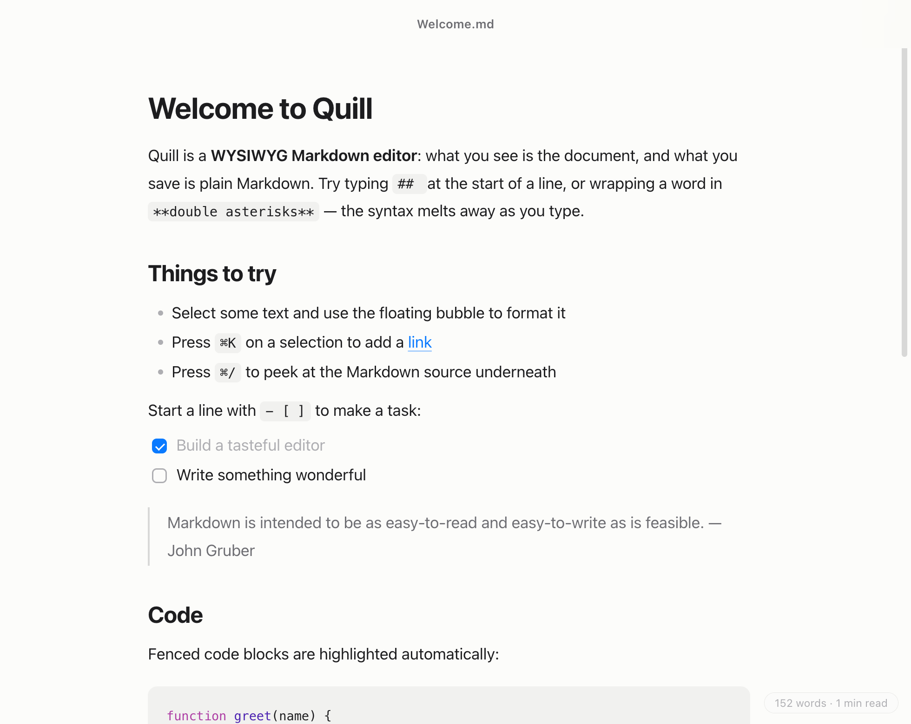
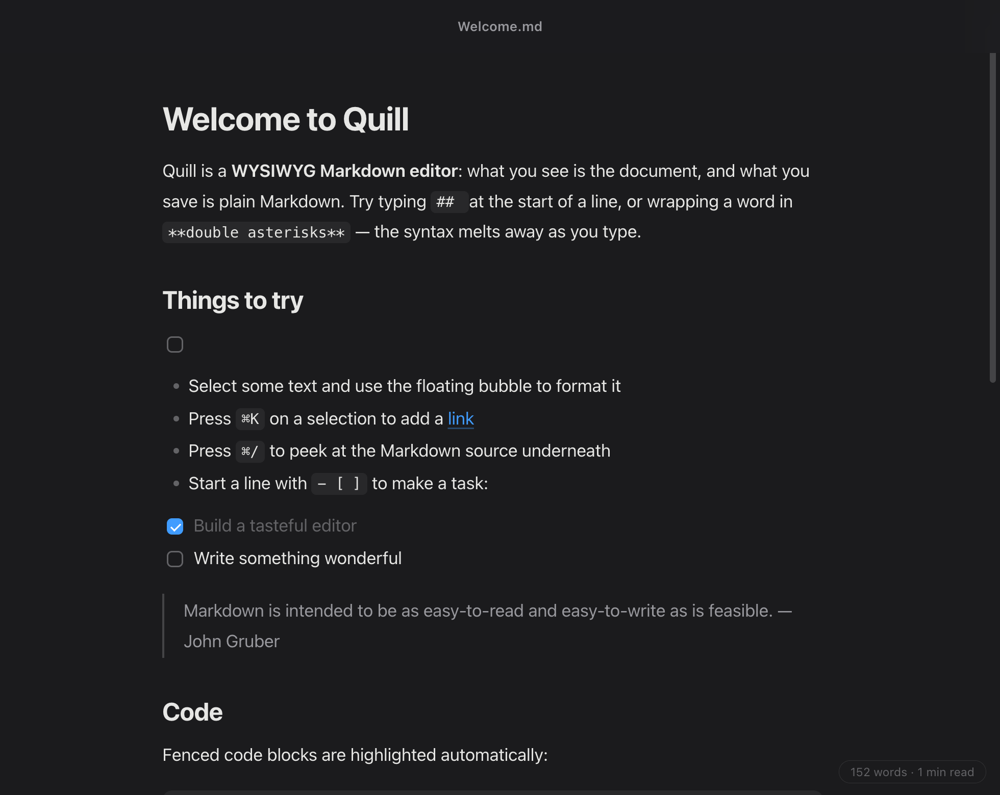

# Quill

A refined, distraction-free WYSIWYG Markdown editor for macOS and Windows.

Quill renders Markdown as you type — headings, emphasis, lists, quotes, code —
while reading and writing plain `.md` files underneath. No split panes, no
preview button: the document *is* the preview.

| Light | Dark |
| --- | --- |
|  |  |

## Download

Grab the latest build from [Releases](../../releases): a `.dmg` for macOS
(Apple Silicon and Intel) or an `.exe` installer for Windows (x64). The
binaries are unsigned — on macOS right-click → **Open** on first launch; on
Windows choose **More info → Run anyway** if SmartScreen appears.

Releases are produced by [GitHub Actions](.github/workflows/release.yml):
every `v*` tag builds, smoke-tests, and packages the app on macOS and Windows
runners, then publishes the artifacts.

## Run from source

```sh
npm install
npm start          # builds the renderer and launches the app
```

Package a standalone app bundle for the current platform:

```sh
npm run pack       # → release/mac-arm64/Quill.app (unpacked, fast)
npm run dist       # → installable dmg / exe
```

## What it does

- **Live WYSIWYG editing** — type `# `, `**bold**`, `> `, `- [ ]`, or
  triple-backtick and watch it become the real thing, instantly.
- **Real Markdown files** — open and save standard `.md`/GFM. Tasks, tables,
  fenced code with syntax highlighting, images, links, and YAML front matter
  all round-trip.
- **Math & diagrams** — `$…$` / `$$…$$` render with KaTeX (double-click to
  edit); ` ```mermaid ` code blocks show a live diagram preview.
- **Never lose work** — saves are atomic, and unsaved changes survive crashes
  and force-quits: the next launch restores them, marked Edited.
- **Find & Replace** — `⌘F`, with `⌘G`/`⇧⌘G` to cycle matches.
- **Images that just work** — paste or drop an image and it's saved to
  `assets/` beside your document with a relative link; relative paths in
  existing files resolve and display.
- **Export** — PDF (via the print pipeline, typography intact) and standalone
  HTML.
- **Open Recent** — native recents on macOS, in the File menu on Windows; the
  last document reopens on launch.
- **Markdown source view** — `⌘/` flips to the raw source and back.
- **Native macOS feel** — hidden-inset title bar, system menus and shortcuts,
  the unsaved-changes dot in the close button, represented-file icon,
  save-before-close prompts, automatic light & dark mode.
- **Quiet chrome** — a floating format bubble on selection, a word-count pill
  in the corner, and otherwise just your text.
- **Drag & drop** a Markdown file anywhere in the window to open it.

## Keyboard

| | |
|---|---|
| `⌘B` / `⌘I` / `⇧⌘X` | bold / italic / strikethrough |
| `⌘E` | inline code |
| `⌘K` | add or edit a link |
| `⌥⌘1…3`, `⌥⌘0` | headings, body text |
| `⇧⌘8` / `⇧⌘7` / `⇧⌘9` | bulleted / numbered / task list |
| `⇧⌘B` | blockquote |
| `⌥⌘C` | code block |
| `⌥⌘T` | insert table (`Tab`/`⇧Tab` moves between cells) |
| `⌥⌘M` | insert math |
| `⌘F` / `⌘G` / `⇧⌘G` / `⌥⌘F` | find / next / previous / replace |
| `⌘/` | toggle Markdown source |
| `⌘S` / `⇧⌘S` / `⌘O` / `⌘N` | save / save as / open / new |

On Windows, use `Ctrl` in place of `⌘`; the menus live in the title bar
(tap `Alt` to open them from the keyboard).

## Architecture

- `electron/main.cjs` — window, native menus, dialogs, file I/O over IPC
- `electron/preload.cjs` — the small `window.quill` bridge (context-isolated)
- `src/main.js` — the editor: Tiptap (ProseMirror) with `tiptap-markdown`
  for parsing/serialization, lowlight for code highlighting
- `src/styles.css` — the entire look: typography, light/dark palettes, chrome
